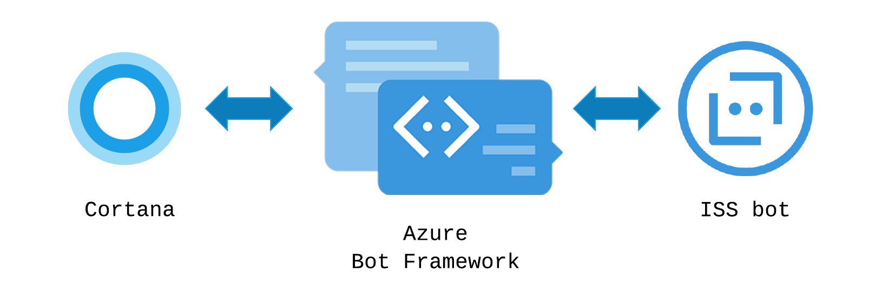

# ISS Cortana Bot
Simple Cortana bot in Node.js for Institute of Systems Science, National University of Singapore



[](https://travis-ci.com/lisaong/iss-cortana-bot)

Credits:
- https://github.com/Microsoft/BotBuilder-Samples/tree/master/Node/demo-RollerSkill

## Install
```
npm install
```

## Run

1. Create a file called `.env` with the following set:
```
MicrosoftAppId=ACTUAL_VALUE_HERE
MicrosoftAppPassword=ACTUAL_VALUE_HERE
```

2. Start the server 
```
npm start
```

## Node.js Deployment

Instructions below are for Azure, but this app is deployable on other systems / cloud providers (it only uses Azure for hosting purposes).

### Azure Deployment

#### One-click Git Deployment
[](https://azuredeploy.net/)

Notes
- The values for MicrosoftAppId and MicrosoftAppPassword will need to be updated when you add Bot Channels Registration.
- If you see an error during deployment, check Azure Portal. The service could be created but maybe the Free Deployment Plan is not available. You may have to select a different Deployment Plan.


#### Manual Git Deployment
The commands below should be run from Azure Cloud Shell.

Good references:
- https://docs.microsoft.com/en-us/azure/app-service/scripts/app-service-cli-scale-high-availability
- https://docs.microsoft.com/en-us/azure/app-service/app-service-deploy-local-git

1. Create the deployment user. Note down the username and password for deployment later.
```
az webapp deployment user set --user-name <username> --password <password>
```

2. Create an Azure App Service Plan from Azure Portal, or use `az appservice plan create` from Azure Cloud Shell. Let's call it `iss-cortana-dev` for example.

3. Create a Resource Group from Azure Portal or use `az group create`. Let's call it `iss-cortana-dev` for example.

4. Create the git-enabled app, replacing your_app_name with your own app name.
```
az webapp create --name your_app_name --resource-group iss-cortana-dev --plan iss-cortana-dev --runtime "node|8.1" --deployment-local-git
```

Save the output somewhere for future reference.

5. Copy the `deploymentLocalGitUrl` output and add an Azure remote from your *local command line* (note: *not* Azure Cloud Shell)
```
git remote add azure <deploymentLocalGitUrl>
```

6. From your *local command line", push to azure, using the username and password from step 1 when prompted.
```
git push azure master
```

The bot should now be available at https://your_app_name.azurewebsites.net/api/messages. If you access this URL from the browser, you should see something like:

```
{"code":"MethodNotAllowed","message":"GET is not allowed"}
```

To use the bot for chats and Cortana, we'll need to add a Bot Channel for it and connect it to the App Service.

## Cortana Skills Bot

Note: This part requires Azure. 

To enable the bot for Cortana, you need to two steps:
A. Create an Azure Bot Channels Registration, pointing it to the URL for your Node.js deployment
B. Add a Cortana channel to the Bot Registration.

#### A. Creating a Bot Channels Registration

This section describes how to add a Azure Bot Channels and bind it with the Node.js service.

[Create your bot channels registration](https://docs.microsoft.com/en-us/azure/bot-service/bot-builder-howto-deploy-azure?view=azure-bot-service-3.0#create-your-bot-channels-registration):

Creates a bot channel that exposes the App Service as an Azure Bot Service. From Azure Portal at https://portal.azure.com:
  1. Create a resource, select `Bot Channels Registration`. Create a bot registration like `iss-cortana-bot-dev`
  2. Use the same resource group as the App Service
  3. Enter the App Service's bot url (the one that ends with /api/messages).
  4. Create a new Microsoft App ID and Password, save it somewhere for the next section.

[Update your bot’s Application Settings](https://docs.microsoft.com/en-us/azure/bot-service/bot-builder-howto-deploy-azure?view=azure-bot-service-3.0#create-your-bot-channels-registration):

Next, update *Azure App Services* with the bot channel's App ID and Password. From Azure Portal at https://portal.azure.com:
  1. Click `App Services` and select the app service that was created (e.g. `iss-cortana-dev`)
  2. Click `Application Settings` within the App Service. Add a setting for `MicrosoftAppId` with the ID generated for `iss-cortana-bot-dev`. Repeat for `MicrosoftAppPassword` with the password.

Note: if you are using a different hosting provider, you can set the environment variables by creating a `.env` file.

Testing the bot:
  1. Open the Bot Registration for `iss-cortana-bot-dev`
  2. Select `Test in Web Chat`

#### B. Adding the Cortana channel

1. From the Bot Channels Registration page on Azure Portal, click on `Channels`
2. Add the `Cortana` channel. 
3. For `Invocation name`, use `ISS`. Cortana will recognize it when a user says "I-S-S"
4. For `Request user profile data`, select `User.SemanticLocation.Current`
5. For `Discovery and Management`, register the Cortana Skill with Knowledge Store.
6. Once you're done, you can then launch Cortana.
    - Make sure your Windows is logged on to the same login account that was used for Azure Portal. This is needed until the Cortana Skill is published.
    - Configure your microphone, following the prompts.
    - Click on the Cortana microphone button.
    - Say `Ask ISS help` to launch the help dialog.

References:
- https://docs.microsoft.com/en-us/cortana/skills/get-started
- https://docs.microsoft.com/en-us/azure/bot-service/bot-service-channel-connect-cortana?view=azure-bot-service-3.0

## Debugging the Cortana Skill

To debug locally, use `ngrok` to tunnel your local endpoint to an external HTTPS URL.

1. Download [ngrok](https://ngrok.com/) (Free registration)
2. Configure the endpoint and note down the ngrok.io URL.
```
ngrok http 3978 -host-header="localhost:3978"
```
3. On Azure Portal, update `Bot Channels Registration` to use the ngrok.io URL. Something like `https://0d6c4024.ngrok.io/api/messages`
4. Now requests to the Cortana channel will redirect to your localhost Node.js instance.

## Documentation

### Bot Builder Node.js
- BotBuilder: https://docs.botframework.com/en-us/node/builder/chat-reference/modules/_botbuilder_d_.html
- Examples: https://github.com/Microsoft/BotBuilder/tree/master/Node/examples

### Cortana Channel
- Inspector: https://docs.botframework.com/en-us/channel-inspector/channels/Cortana/
- Cards: https://docs.microsoft.com/en-us/cortana/skills/cards
- Adaptive Cards: http://adaptivecards.io/visualizer/index.html?hostApp=Cortana%20Skills
